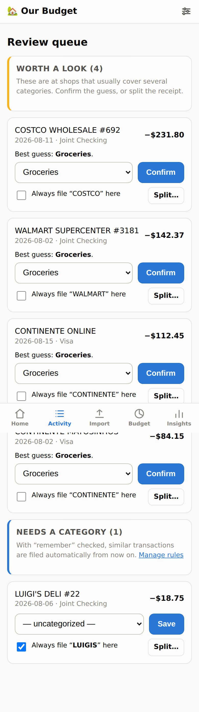
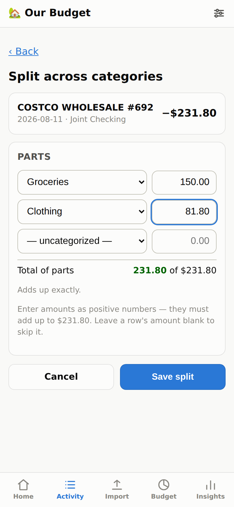
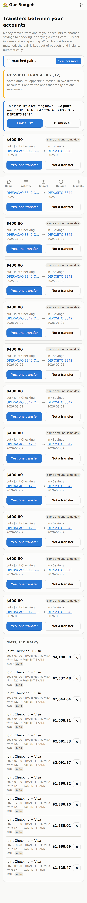

# 🏡 HouseBudget

A **self-hosted budget vs. actuals app for two people** — you and your partner.
Upload your bank / credit-card statements, let the app classify every expense
into your budget categories, and check how the month is going from your phones.

**Your data never leaves your server.** No bank aggregators, no analytics, no
third-party services — just a small Python app and a single SQLite file that
you own and can back up with one tap.

| Dashboard | Insights | Import preview |
|---|---|---|
|  |  |  |

| Review queue — confirm or split | Splitting one receipt | Transfer matching |
|---|---|---|
|  |  |  |

## What it does

- **Statement import — including the PDF your bank actually sends you**, plus
  CSV, Excel (.xlsx) and OFX/QFX where a bank offers them. Column layout, date
  format (day-first vs month-first), decimal commas and debit/credit columns
  are auto-detected; you confirm a preview before anything is saved, and the
  app remembers each bank's layout afterwards.
  A PDF has no table structure, only words with positions, so the table is
  rebuilt from the layout: amounts are found by a strict two-decimal pattern
  (an IBAN block or a store number is never read as money), their right edges
  are clustered into columns so a debit-only row and a credit-only row stay in
  their own columns, a description wrapped onto a second line is rejoined, page
  headers and footers are ignored, and a year missing from the rows is taken
  from the statement header. Scans and photos have no text to read and are
  rejected with an explanation rather than silently importing nothing.
- **Safe re-imports** — upload overlapping statements any time; duplicates are
  detected and skipped, and any import can be undone from the history page.
- **Auto-classification that learns** — a rules engine ships with common
  merchants (groceries, fuel, subscriptions, …). Anything unknown lands in a
  review queue; when you file it, the app offers to remember the merchant so it
  never asks again. It also suggests the category you have used most often for
  that merchant. Rules are fully editable.
- **Mixed-basket shops are flagged, not guessed at** — a Costco, Amazon,
  Walmart or Continente charge over $50 gets the most likely category *and* a
  request to confirm, because one receipt there is rarely one budget line.
- **Split a receipt across categories** — that $231.80 Costco run becomes
  $150 groceries + $81.80 clothing. Each part lands in its own budget category;
  the totals, merchant list and trends still count the charge once.
- **No double counting** — transfers between your own accounts and credit-card
  payments are tracked but excluded from budgets and insights.
- **Budget vs. actuals** — monthly budgets per category (copy last month with
  one tap), progress bars that go orange near the limit and red over it.
- **Transfers are matched, not guessed** — money moved between your own
  accounts (savings to checking, paying a card) is found by matching the two
  sides to each other: same amount, opposite direction, a few days apart. That
  works whatever your bank calls it. Obvious pairs link themselves; anything
  less certain is offered for confirmation, and a recurring monthly move is
  confirmed once for all of its occurrences. A one-sided transfer is flagged,
  because it usually means a statement is missing.
- **Insights** — spending pace against last month and budget, monthly surplus
  and deficit, 12-month cashflow, where the money goes over time, biggest
  movers against a 3-month average, year-over-year, per-category trends, top
  merchants, largest expenses, **recurring-subscription detection**, savings
  rate, and alerts when a category runs well above its usual.
- **Two logins, one household** — separate passwords for each of you, same
  shared data. Works great on phones (installable as a home-screen app),
  light and dark mode.
- **Your data, always** — export everything to CSV or download the SQLite
  database from Settings.

## Run it on your own computer

Requires Python 3.11+ ([python.org/downloads](https://www.python.org/downloads/);
on Windows tick **"Add python.exe to PATH"** during setup). Nothing else to
install — the launcher builds its own environment on first run.

**Windows** (Command Prompt or PowerShell):

```
git clone https://github.com/<you>/housebudget.git
cd housebudget
run.bat
```

**macOS / Linux:**

```bash
git clone https://github.com/<you>/housebudget.git
cd housebudget
./run.sh
```

Open **http://localhost:8000**. The first visit walks you through creating your
two logins. The files in `samples/` let you try the import flow before using
real statements.

The launcher prints where your data is kept every time it starts.

**To use it from your phones on the home wi-fi**, start it listening on the
network and open the address it prints (something like `http://192.168.1.20:8000`):

| | |
|---|---|
| Windows | `set HOST=0.0.0.0` then `run.bat` |
| macOS / Linux | `HOST=0.0.0.0 ./run.sh` |

That's plain HTTP with no certificate — fine on your own network, but don't do
it on public wi-fi, and use the Docker + Caddy setup below if you want it
reachable from outside the house. Use `PORT` the same way if 8000 is taken.

### Where your data lives

Everything — the database, the uploaded statement files and the cookie-signing
key — goes in a `.housebudget` folder in your home directory
(`C:\Users\you\.housebudget` on Windows, `~/.housebudget` elsewhere),
deliberately *outside* the code folder. That means you can delete the project
folder, re-clone it, or run `git clean -xdf` in it without touching your
financial history. Nothing financial is ever committed to git; there's a test
asserting it.

Put it somewhere else by setting `HB_DATA_DIR` before starting.

**Back it up.** Settings → *Download database backup* gives you a single file
containing everything; restoring is dropping it back as `budget.db` in that
folder. Copying that file somewhere safe now and then is the whole backup
strategy.

## Later: put it on your own domain (with HTTPS)

When you want it reachable from anywhere, not just the house. You need a small
Linux server (any €4–6/month VPS — Hetzner, DigitalOcean, Lightsail, …) with
Docker installed, and a domain or subdomain.

1. **Point DNS at the server**: create an `A` record, e.g.
   `budget.yourdomain.com → <server IP>`.
2. **Clone and configure**:
   ```bash
   git clone <this repo> && cd housebudget
   cp .env.example .env        # edit: DOMAIN=budget.yourdomain.com
   ```
3. **Start**:
   ```bash
   docker compose up -d --build
   ```
   Caddy fetches and renews the HTTPS certificate automatically. Open
   `https://budget.yourdomain.com`, create your two logins, done.

Data lives in `/srv/housebudget-data` on the host (change it with
`HB_DATA_PATH` in `.env`), outside the code checkout for the same reason as
above. **Back that directory up**, or use *Download database backup* in
Settings.

Moving from your laptop to a server later is just copying `budget.db` across.

Alternative without opening ports: run it at home and put
[Tailscale](https://tailscale.com) or a Cloudflare Tunnel in front — the app
itself is unchanged.

### Security notes

- Passwords are bcrypt-hashed; sessions are signed, HttpOnly, SameSite cookies.
- Login attempts are rate-limited; all forms are CSRF-protected.
- The app sets strict security headers and serves no third-party assets.
- Keep it behind HTTPS (the included Caddy setup does this for you).
- Locked out? `docker compose exec app python -m app.cli reset-password <username>`

## Using it month to month

1. **Once a month (or whenever)**: grab the statement from each bank and card —
   the PDF they email or publish is fine — and upload it on the Import tab.
   Both of you can do this from your phones. **Check the preview**, especially
   the first time you import a given bank: the dates and amounts are shown
   before anything is saved, and any column can be corrected there.
2. **Review**: the queue has two parts. *Needs a category* is anything the app
   couldn't place — filing one with “remember” checked teaches it the merchant
   for next time, so after a couple of months almost everything classifies
   itself. *Worth a look* is the big-box charges: tap **Confirm** to accept the
   suggested category, or **Split…** to divide the receipt across categories.
3. **Check the dashboard**: budget bars, overspend alerts, what's left this
   month. Insights shows trends, subscriptions and where the money went.
4. **Paystubs**: your net pay appears automatically in the checking-account
   statement (classified as Salary). If you want to log a paystub manually
   (e.g. cash income), use *Activity → Add manually*.

### Importing your old spreadsheets

If your previous budget spreadsheets have transaction rows
(date / description / amount), export each sheet as CSV and import it like a
statement — the mapping preview handles most layouts. Budgets themselves are
quick to enter on the Budget tab (set one month, then *copy* it forward).

## Roadmap ideas

- **Paystub import** — today your net pay is picked up automatically from the
  bank statement and filed as Salary, so gross pay and deductions (tax, health
  insurance, retirement) are not visible. A paystub is one event broken into
  components rather than a list of events, so importing one means creating a
  gross entry plus deduction entries and then matching them against the deposit
  already in your statement, to avoid counting pay twice. A short manual form
  would be far more reliable than parsing employer PDFs, which vary and change.
- **Automatic bank sync** — true automatic connections require either your
  bank's official API (open banking, where available) or a third-party
  aggregator (Plaid, GoCardless, …), which conflicts with the
  nothing-leaves-the-server goal. A middle ground that keeps data local:
  scheduled import from a folder/email inbox where your bank sends statement
  exports. The statement-import pipeline is built so a sync source can be
  added without changing anything else.
- **Amazon order detail** — Amazon can export per-item order history, which
  could be matched to card charges by amount and date to label what was
  actually bought. Amazon charges per shipment, so one order can be several
  charges and one charge several items; the matching is fuzzy and would need
  review. Splitting covers most of this need already.
- **Scanned PDF statements** — a scan or photo has no text to read, so it needs
  OCR. Doable with tesseract, but accuracy on figures is the whole problem: a
  misread digit becomes a wrong amount that nothing downstream can catch.
- Shared savings goals, yearly view, category drill-downs.

## Tech notes (for future changes)

- **Stack**: FastAPI + Jinja2 server-rendered pages, SQLite, no JS framework
  (one small progressive-enhancement script), charts are server-generated SVG.
- **Layout**: `app/parsing/` (statement formats, including the PDF layout
  reconstruction) · `app/services/` (classify, import/dedupe, budgets, splits,
  transfers, insights, charts) · `app/routes/` + `app/templates/` (pages) ·
  `tests/` (84 tests: parsers, PDF extraction across four statement layouts,
  dedupe, rules, budget math, splitting, transfer pairing, analytics, chart
  rendering, data location, schema migration, and a full end-to-end journey).
- Test statement PDFs are generated in `tests/pdf_fixtures.py` rather than
  committed, so no real statement is ever needed in the repo.
- Charts are server-rendered SVG with no JS library. The categorical palette is
  fixed-order and validated for colour-blind separation and contrast in both
  light and dark mode; series colours are never cycled or reassigned.
- Money is stored as integer cents; expenses negative, income positive.
- Runs on Windows, macOS and Linux: `run.bat` / `run.sh` are equivalent, text
  files are read and written as UTF-8 rather than the platform default, and
  `.gitattributes` pins script line endings so a Windows checkout doesn't break
  the shell script (or vice versa). The test suite covers these.
- Every money aggregate reads the `txn_allocations` view rather than the
  `transactions` table, so a split transaction contributes each part to its own
  category while still counting once as a charge. Uncategorized money is
  excluded from both the dashboard and Insights and reported separately.
- The schema is versioned (`PRAGMA user_version`) with migrations in
  `app/db.py`; existing databases upgrade automatically on startup.
- Run tests: `.venv/bin/python -m pytest tests/`
