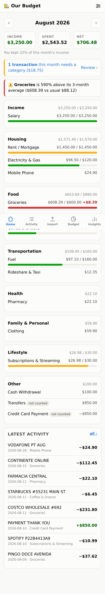
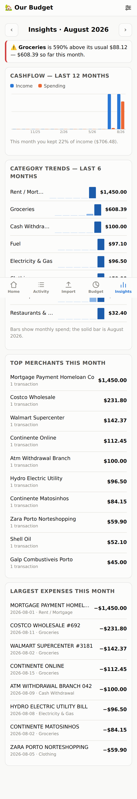
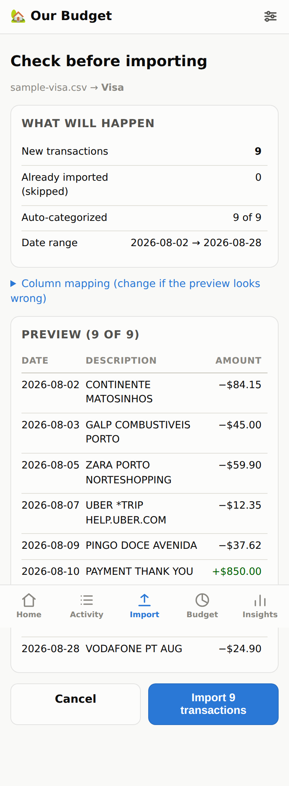

# 🏡 HouseBudget

A **self-hosted budget vs. actuals app for two people** — you and your partner.
Upload your bank / credit-card statements, let the app classify every expense
into your budget categories, and check how the month is going from your phones.

**Your data never leaves your server.** No bank aggregators, no analytics, no
third-party services — just a small Python app and a single SQLite file that
you own and can back up with one tap.

| Dashboard | Insights | Import preview |
|---|---|---|
|  |  |  |

## What it does

- **Statement import** — CSV, Excel (.xlsx) and OFX/QFX exports from any bank.
  Column layout, date format (day-first vs month-first), decimal commas and
  debit/credit columns are auto-detected; you confirm a preview before anything
  is saved, and the app remembers each bank's format afterwards.
- **Safe re-imports** — upload overlapping statements any time; duplicates are
  detected and skipped, and any import can be undone from the history page.
- **Auto-classification that learns** — a rules engine ships with common
  merchants (groceries, fuel, subscriptions, …). Anything unknown lands in a
  review queue; when you file it, the app offers to remember the merchant so it
  never asks again. Rules are fully editable.
- **No double counting** — transfers between your own accounts and credit-card
  payments are tracked but excluded from budgets and insights.
- **Budget vs. actuals** — monthly budgets per category (copy last month with
  one tap), progress bars that go orange near the limit and red over it.
- **Insights** — 12-month cashflow, per-category trends, top merchants,
  largest expenses, **recurring-subscription detection**, savings rate, and
  alerts when a category runs well above its 3-month average.
- **Two logins, one household** — separate passwords for each of you, same
  shared data. Works great on phones (installable as a home-screen app),
  light and dark mode.
- **Your data, always** — export everything to CSV or download the SQLite
  database from Settings.

## Quick start (try it locally)

Requires Python 3.11+.

```bash
./run.sh                    # creates .venv, installs deps, starts the app
# open http://localhost:8000 — the first visit walks you through creating
# your two logins. Try the files in samples/ to see the import flow.
```

## Deploy on your own domain (with password + HTTPS)

You need a small Linux server (any €4–6/month VPS — Hetzner, DigitalOcean,
Lightsail, …) with Docker installed, and a domain or subdomain.

1. **Point DNS at the server**: create an `A` record, e.g.
   `budget.yourdomain.com → <server IP>`.
2. **Clone and configure**:
   ```bash
   git clone <this repo> && cd housebudget
   cp .env.example .env        # edit: DOMAIN=budget.yourdomain.com
   ```
3. **Start**:
   ```bash
   docker compose up -d --build
   ```
   Caddy fetches and renews the HTTPS certificate automatically. Open
   `https://budget.yourdomain.com`, create your two logins, done.

Everything lives in `./data/` (database, uploaded statements, cookie-signing
key). **Back that folder up** — or just tap *Download database backup* in
Settings now and then.

Alternative without opening ports: run it at home and put
[Tailscale](https://tailscale.com) or a Cloudflare Tunnel in front — the app
itself is unchanged.

### Security notes

- Passwords are bcrypt-hashed; sessions are signed, HttpOnly, SameSite cookies.
- Login attempts are rate-limited; all forms are CSRF-protected.
- The app sets strict security headers and serves no third-party assets.
- Keep it behind HTTPS (the included Caddy setup does this for you).
- Locked out? `docker compose exec app python -m app.cli reset-password <username>`

## Using it month to month

1. **Once a month (or whenever)**: download statements from each bank/card
   site (CSV or Excel; OFX is even better) and upload them on the Import tab —
   both of you can do this from your phones.
2. **Review**: the app tells you how many transactions need a category. Filing
   one with “remember” checked teaches it the merchant for next time — after a
   couple of months almost everything classifies itself.
3. **Check the dashboard**: budget bars, overspend alerts, what's left this
   month. Insights shows trends, subscriptions and where the money went.
4. **Paystubs**: your net pay appears automatically in the checking-account
   statement (classified as Salary). If you want to log a paystub manually
   (e.g. cash income), use *Activity → Add manually*.

### Importing your old spreadsheets

If your previous budget spreadsheets have transaction rows
(date / description / amount), export each sheet as CSV and import it like a
statement — the mapping preview handles most layouts. Budgets themselves are
quick to enter on the Budget tab (set one month, then *copy* it forward).

## Roadmap ideas

- **Automatic bank sync** — true automatic connections require either your
  bank's official API (open banking, where available) or a third-party
  aggregator (Plaid, GoCardless, …), which conflicts with the
  nothing-leaves-the-server goal. A middle ground that keeps data local:
  scheduled import from a folder/email inbox where your bank sends statement
  exports. The statement-import pipeline is built so a sync source can be
  added without changing anything else.
- **PDF statements** — banks' PDFs vary wildly; CSV/Excel/OFX exports are more
  reliable. If one of your banks only offers PDF, open an issue with a sample
  layout (redacted!) and a parser can be added for that bank.
- Shared savings goals, yearly view, category drill-downs.

## Tech notes (for future changes)

- **Stack**: FastAPI + Jinja2 server-rendered pages, SQLite, no JS framework
  (one small progressive-enhancement script), charts are server-generated SVG.
- **Layout**: `app/parsing/` (statement formats) · `app/services/` (classify,
  import/dedupe, budgets, insights, charts) · `app/routes/` + `app/templates/`
  (pages) · `tests/` (32 tests: parsers, dedupe, rules, budget math, insights,
  and a full end-to-end journey).
- Money is stored as integer cents; expenses negative, income positive.
- Run tests: `.venv/bin/python -m pytest tests/`
